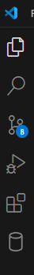
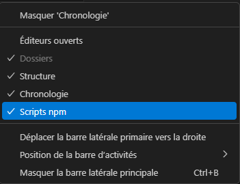
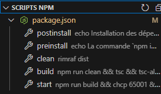
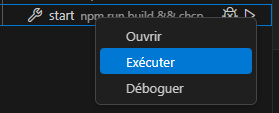

# ESICAD TypeScript boilerplate

Ce projet a pour but de vous exercer à écrire vos premières lignes de code en TypeScript.

## Installation

1. En premier lieu, pour que le projet fonctionne, il faut que le code source du dépot Git soit rapatrié sur votre machine.
   Pour ce faire, ouvrez une invite de commande Git bash et lancer dans l'ordre les commandes suivantes :

```bash
# Pour vous positionner à la racine de votre disque dur (cd = change directory)
cd /c
# Pour créer un dossier "projects" (mkdir = make directory)
mkdir projects
# le . indique que l'on part du répertoire où la console est positionnée > on va donc rentrer dans le dossier projects que l'on vient de créer
cd ./projects
```

Puis il vous faut copier la commande obtenue par le clic sur le bouton "Clone" sur GitLab et la coller dans l'invite de commande (on parle également de console, de terminal, ou de shell).

_Je vous recommande **fortement** de mettre tous vos projets dans un dossier `projects` à la racine de votre disque dur, cela peut vous éviter bien des problèmes !_

2. Dans un second temps, il vous faut ouvrir le dossier contenant le projet avec Visual Studio Code. Pour ce faire, ouvrez le menu `Fichier > Ouvrir un dossier...` et sélectionner le dossier `ESICAD-typescript-boilerplate` de votre projet.

3. La fenêtre de Visual Studio Code s'ouvre. Sur la gauche, un panneau avec des icônes permet de naviguer entre les fonctionnalités principales de l'environnement de développement (Explorateur de fichiers, Recherche, Versionnement, Debugger,Extensions) :

   

   Cliquez sur le premier et sur le panneau `ESICAD-boilerplate`, faites un clic droit pour activer le panneau NPM dans l'explorateur de fichiers :

   

   Un panneau `Scripts NPM` est maintenant présent dans l'explorateur de fichiers. cliquer sur le panneau pour l'ouvrir :

   

   Sur la ligne `package.json`, faites un clic-droit puis cliquer sur `Exécuter Install`. Un panneau inférieur s'ouvre et vous informe de l'installation des librairies utilisées sur ce projet. Il peut maintenant être lancé !

## Fonctionnement du projet

Pour lancer le programme du projet, il faut exécuter le script `start` qui est défini dans le panneau Scripts NPM. Pour ce faire, clic-droit sur `start`> `Exécuter`:


